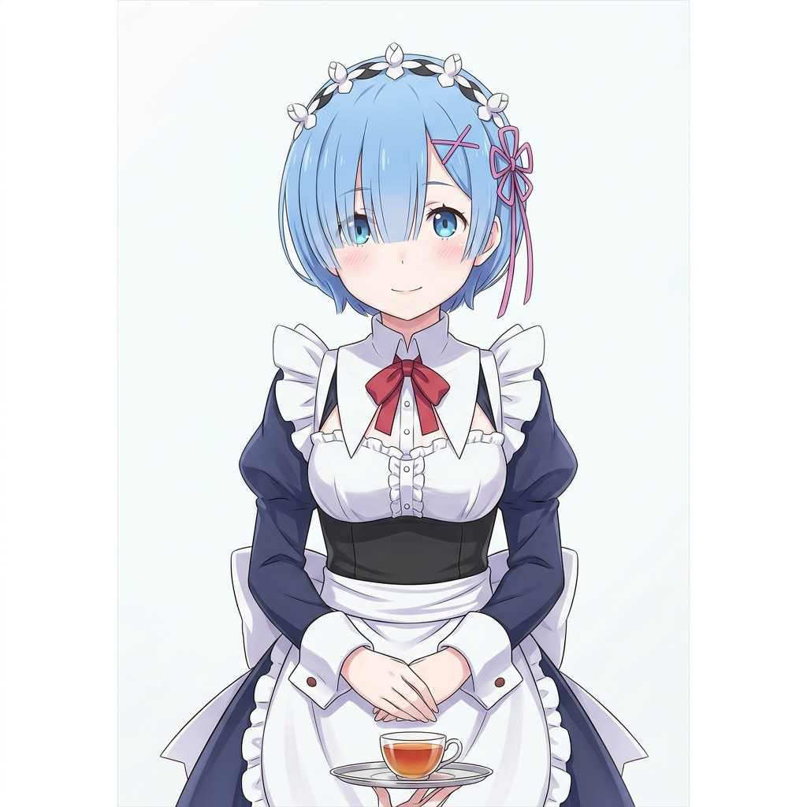

<!-- 
PORTOFOLIO OF YUMEIRO DESU


-->


<div align="center">


<br/>


<br/>

<a href="https://animekita.online" target="_blank"></a>

<a href="mailto:kaguraisempai@gmail.com"></a>

<a href="https://www.npmjs.com/~cdn-lib"></a>
</div>

---
# List Menu
<div align="center">

| | | |
| :---: | :---: | :---: |
| [**TENTANG**](#tentang-saya) | [**WAIFU**](#waifu-favorit) | [**TOOLS**](#alat-tempur) |
| [**PROYEK**](#proyek-berjalan-baru) | [**STATS**](#statistik-github) | [**ACHIVE**](#pencapaian) |

</div>

---
# TENTANG SAYA
RUN SENDIRI YA

```code
php yume.php
```

```php
<?php

class YumeDeveloper
{
    private const C_CYAN   = "\e[1;36m";
    private const C_GREEN  = "\e[1;32m";
    private const C_WHITE  = "\e[1;37m";
    private const C_YELLOW = "\e[1;33m";
    private const C_RED    = "\e[1;31m";
    private const C_RESET  = "\e[0m";

    public string $nama     = "Noval Ramdhani";
    public string $alias    = "YUME DEVELOPER";
    public string $pengguna = "cdn-lib";
    public string $lokasi   = "Indonesia";

    public array $stack = [
        "Programming" => ["PHP", "JavaScript", "Python 2.7", "Kotlin"],
        "Web Tech"    => ["HTML5", "CSS3", "jQuery", "Node.js"],
        "Environment" => ["Termux", "Linux", "Android Development"],
        "Expertise"   => ["API Integration", "Web Scraping", "UI/UX Design"]
    ];

    public array $proyekAktif = [
        "Official Site"   => "https://animekita.online",
        "Yumeiro Stream"  => "Anime Streaming Platform",
        "SMTP Mailer Kit" => "PHP Email Library",
        "Telegram Bot"    => "Server Monitor Tool",
    ];

    public function sedangBelajar(): array 
    {
        return ["Node.js", "Live2D Illustration", "Bahasa Jepang"];
    }

    private function getGithubMeta(): array
    {
        $url = "https://api.github.com/users/" . $this->pengguna;
        $opts = ["http" => ["method" => "GET", "header" => "User-Agent: PHP-Profile\r\n"]];
        $ctx  = stream_context_create($opts);
        $res  = @file_get_contents($url, false, $ctx);
        
        if ($res) {
            $data = json_decode($res, true);
            return [
                "Repositories" => $data['public_repos'] ?? 0,
                "Followers"    => $data['followers'] ?? 0,
                "Following"    => $data['following'] ?? 0,
                "Profile_URL"  => "github.com/" . $this->pengguna
            ];
        }
        return ["GitHub" => "Connection Failed / Offline"];
    }

    private function getSystemTelemetry(): array
    {
        return [
            "OS_KERNEL" => PHP_OS,
            "PHP_VER"   => phpversion(),
            "MEM_PEAK"  => round(memory_get_peak_usage() / 1024 / 1024, 2) . " MB",
            "ENGINE"    => "Zend Engine " . zend_version(),
            "STATUS"    => "System Operational"
        ];
    }

    private function drawLine(string $char = "-"): void
    {
        echo self::C_CYAN . str_repeat($char, 60) . "\n" . self::C_RESET;
    }

    public function build(): void
    {
        $telemetry = $this->getSystemTelemetry();
        $github    = $this->getGithubMeta();

        $this->drawLine("=");
        echo self::C_WHITE . " [ SYSTEM CORE ] : " . $this->alias . " | v2.1.0-STABLE\n" . self::C_RESET;
        $this->drawLine("=");

        echo self::C_GREEN . " ID_ENTITY\n" . self::C_RESET;
        printf("  %-15s : %s\n", "NAME", $this->nama);
        printf("  %-15s : %s\n", "LOCATION", $this->lokasi);
        printf("  %-15s : %s\n", "ALIAS", $this->pengguna);
        echo "\n";

        echo self::C_GREEN . " REMOTE_GIGTHUB_STATS\n" . self::C_RESET;
        foreach ($github as $key => $val) {
            printf("  %-15s : %s\n", $key, $val);
        }
        echo "\n";

        echo self::C_GREEN . " TECHNICAL_INFRASTRUCTURE\n" . self::C_RESET;
        foreach ($this->stack as $cat => $items) {
            printf("  %-15s : %s\n", $cat, implode(", ", $items));
        }
        echo "\n";

        echo self::C_GREEN . " DEPLOYED_PROJECTS\n" . self::C_RESET;
        foreach ($this->proyekAktif as $name => $desc) {
            printf("  * %-15s | %s\n", $name, $desc);
        }
        echo "\n";

        echo self::C_GREEN . " SYSTEM_TELEMETRY\n" . self::C_RESET;
        foreach ($telemetry as $key => $val) {
            printf("  %-15s : %s\n", $key, $val);
        }

        $this->drawLine("=");
        echo self::C_YELLOW . " TRANSMISSION COMPLETED\n" . self::C_RESET;
        $this->drawLine("=");
    }
}

$core = new YumeDeveloper();
$core->build();
?>
```

---

# WAIFU FAVORIT

<br/>

<div align="center">
<br/>

<a href="https://github.com/cdn-lib/cdn-lib">
  
</a>

<br/>

<table>
<tr>

<td align="center" width="300">


<br/><br/>



<br/>


</td>

<td valign="top">


```yaml
nama       : レム (Rem)
anime      : Re:Zero kara Hajimeru Isekai Seikatsu
ras        : Oni — 半鬼族 (Setengah Iblis)
pekerjaan  : Pelayan Istana Roswaal
senjata    : Gada Bola (Morning Star)
```


```yaml
nama       : 水瀬いのり (Minase Inori)
lahir      : 2 Desember 1994, Osaka, Jepang
agensi     : I'm Enterprise
peran_lain :
  - Isla     (Plastic Memories)
  - Yoshino  (Date A Live III)
  - Hinazuki (Boku dake ga Inai Machi)
```


```
Rem adalah simbol kesetiaan dan pengorbanan.
僕はレムが一番好き！
Tidak ada yang lebih setia dari Rem.
```

</td>
</tr>
</table>

<br/>

</div>

---

# ALAT TEMPUR

<div align="center">

<br/>

[](https://skillicons.dev)

</div>

---

# PROYEK BERJALAN (BARU)

<br/>

<div align="center">

<a href="https://github.com/cdn-lib/smtp">
  
</a>

<a href="https://github.com/cdn-lib/ChatAIApp">
  
</a>

</div>

<br/>

| Proyek | Deskripsi | Stack |
|--------|-----------|-------|
| [**SMTP Mailer Kit**](https://github.com/cdn-lib/smtp) | Kit email PHP siap pakai — Kontak dan Langganan, balas otomatis, satu file konfigurasi | `PHP` `PHPMailer` `CSS` |
| [**ChatAI App**](https://github.com/cdn-lib/ChatAIApp) | Aplikasi chat bertenaga AI, dukungan banyak model | `JavaScript` `HTML` |
| [**KizunaNET**](https://animekita.online) | Platform konten anime dengan katalog produk dan checkout | `PHP` `SQLite` |

---

# STATISTIK GITHUB

<br/><br/>

<div align="center">


<br/>


<br/>


</div>

---

# PENCAPAIAN

<br/>

<div align="center">
  
  <br/>
  <sub><i> </i></sub>
</div>

---

<div align="center">
# KATA-KATA HARI INI
<br/>

> *「どんなに辛くても、あきらめないでください」*
>
> **"Seberapa pun sulitnya, jangan pernah menyerah."**
>
> 

</div>

---

<div align="center">


<br/>


</div>

<!-- FOOTER BERGELOMBANG -->

